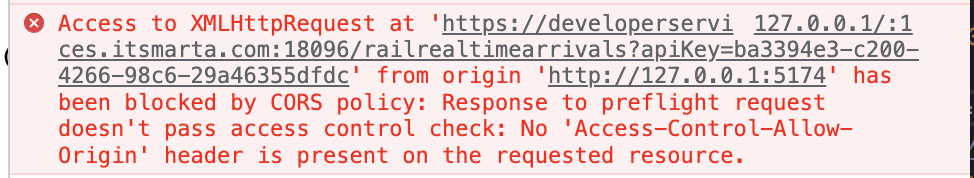

# Marta Arrivals Exercise

This application gives the user a list of train stations to select as their Starting Point.
Once they have selected a Starting Point, the app will display the next arrival times of that station.

## Features
- Typeahead inputs
- Interactive SVG map
- Responsiveness

## Tech
- SVGR
- Vite
- react-select
- chakra-ui

## Challenges
One of the biggest challenges I faced during this exercise was connecting to the Marta API. After receiving the API key from Marta, I would consistently hit a CORS error: 

I tried proxying the request which would return a 403 Unauthorized Error.
I considered setting up a back end to securely store the API key and build my own proxy. Alas, since this is a front end challenge, I decided to stick to focusing on the front end implementation.
